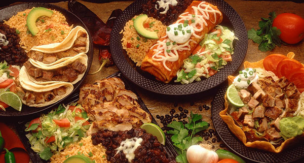
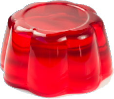
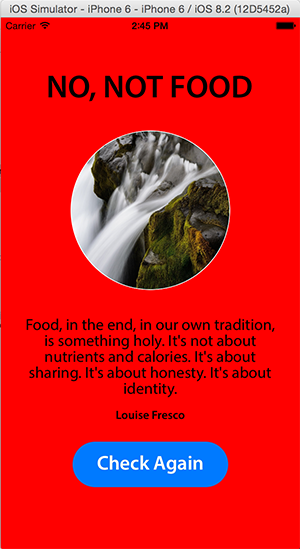

# Is It Food?

Primary repository for iOS `Is It Food?` app.

See `charlierproctor/is_it_food_serv` for the server backend.

## The Problem
We as humans all face one common, natural question -- **is it food?** 

Bacon. *Is it food?*

A sock. *Is it food?*

An apple. *Is it food?*

A cup. Chocolate. Pasta. The guitar. A rug. 

*Is it food?*

Food is special in its inherent universality... yet we struggle to identify it from all the horrible imposters out there.

## The Solution

We have the solution. `Is It Food?` uses proprietary technology to determine whether or not a chosen item is food. 

All you have to do is take a picture of the item. `Is It Food?` will do the rest. Our app determines whether or not the object is food, displays a useful food-related quotation, and shows you the picture of your object. 

## Get Started Now

Download and install the app. Tap `Check Now` and never worry again about whether or not what you're eating is food.

## Technical Details

- This app uses [Alamofire](https://github.com/Alamofire/Alamofire) for handling API requests.
	- All quotes are fetched from the server defined in `is_it_food_serv`, which is currently hosted at [http://isitfood.herokuapp.com](http://isitfood.herokuapp.com).
- You are able to take a picture of the object you are testing. To do this, we've used a `UIImagePickerController`.

## Disclaimer

The process of determing whether an item is food is purely random. The app has a 50% chance of being right. 

USE OUR APP AT YOUR OWN RISK. 
